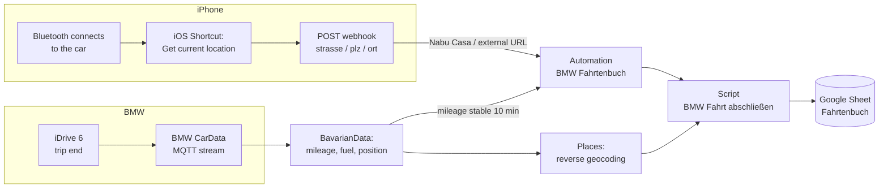

# Home Assistant BMW Logbook for iDrive 6 – BMW CarData · iPhone Bluetooth Webhook · Google Sheets

An automatic **driving logbook (Fahrtenbuch)** for older BMWs (here a G31 530d with **iDrive 6**) in Home Assistant. Every trip ends up as one row in a Google Sheet, with:

- start and end time, duration
- start and destination address (street, house number, postcode, city) and a display name like "Home"
- start and end mileage, distance
- fuel at start and end, consumption in litres and l/100 km

It uses the official **BMW CarData** stream (via the [BavarianData](https://github.com/JustChr/BavarianData) integration), the iPhone's Bluetooth connection to the car as the start signal, and the **Google Sheets** integration as the logbook. No BMW app, no third-party logbook service, no subscription.

It also fits with my other Home Assistant projects: the [Dahua VTO intercom](https://github.com/ursubey/Home-Assistant-Dahua-VTO-Frigate-go2rtc-intercom-Switchbot-Lock-ultra/releases/tag/HASSOS) and the [alarm system](https://github.com/ursubey/Home-Assistant-Alarm-System-Alarmo-Frigate-Presence).

> All entity IDs, IDs and URLs in this guide are placeholders. Replace `my_bmw`, `my_iphone`, the webhook ID and the Google Sheets config entry with your own values.

---

## 1. Why this is not trivial with iDrive 6

| Limitation | Consequence |
|---|---|
| iDrive 6 sends mileage, fuel and position **only at the end of a trip** | Home Assistant does not know when a trip starts, or where |
| The integration's own trip detection needs a live GPS stream | It does not work for these cars |
| The door unlock status is not streamed | It cannot be used as a start signal |
| BMW CarData API quota: **50 calls per day** | No polling; the MQTT stream is the data source |
| The MQTT stream reconnects about every 45 minutes (token refresh) | Normal, no data loss |

The solution therefore takes:

- **Trip start** from the **iPhone**: the moment it connects to the car via Bluetooth, an iOS Shortcut sends a webhook to Home Assistant, including the current address.
- **Trip end** from the **car**: when the mileage has not changed for 10 minutes, the trip is closed and written to the sheet.

---

## 2. How it works



**Trip start (webhook):**

1. If a trip is still open and the mileage has gone up, the previous trip has ended but was not closed yet. It is closed and logged first.
2. A second webhook within 30 minutes is ignored as a duplicate.
3. The start address is taken in this order:
   1. the address sent by the iOS Shortcut in the webhook
   2. the HA Companion App's *Geocoded Location* sensor, if it is at most 5 minutes old (waits up to 90 s for an update)
   3. the destination of the previous trip
   4. the car's last position
4. Start time, mileage and fuel are stored, and the trip is marked as open.

**Trip end (mileage stable for 10 minutes):**

1. The script only continues if the mileage really went up.
2. If no start signal arrived, the trip is still logged: start = end of the previous trip, marked "(no start signal)".
3. The destination comes from the car position (Places sensors). Known zones are written by name, e.g. "Home".
4. A persistent notification with all values is created first. It is removed only after the row was written to Google Sheets. If the Sheets call fails, the trip is not lost.

---

## 3. Components

| Component | Purpose |
|---|---|
| [BavarianData](https://github.com/JustChr/BavarianData) (HACS) | BMW CarData stream: mileage, fuel level, position |
| [Places](https://github.com/custom-components/places) (HACS) | Reverse geocoding (OpenStreetMap) of the car's device tracker: street, house number, postcode, city |
| [Google Sheets](https://www.home-assistant.io/integrations/google_sheets/) | `google_sheets.append_sheet` writes one row per trip |
| HA Companion App (iOS) | optional fallback: `sensor.<iphone>_geocoded_location` and the iPhone device tracker |
| iOS Shortcuts | personal automation "When Bluetooth connects to the car" |
| Nabu Casa or another external URL | the webhook must be reachable from the mobile network |

Entities used in the configs below:

| Placeholder | What it is |
|---|---|
| `sensor.my_bmw_mileage` | mileage from BavarianData |
| `sensor.my_bmw_fuel_level` | fuel level in litres from BavarianData |
| `device_tracker.my_bmw` | car position from BavarianData |
| `sensor.my_bmw_places_street`, `_street_number`, `_postal_code`, `_city` | Places sensors for the car tracker |
| `sensor.my_iphone_geocoded_location` | Companion App sensor (fallback only) |
| `device_tracker.my_iphone` | iPhone tracker, used for the zone name of the start |

---

## 4. Google Sheet

Create a sheet with a worksheet named **`Fahrtenbuch`** and this header row in A1:V1. The names must match exactly, because `append_sheet` maps the data by column name:

```text
Datum | Startzeit | Start | Start PLZ | Start Ort | Start Straße | Start Hausnummer | Endzeit | Fahrtdauer | Ziel | Ziel PLZ | Ziel Ort | Ziel Straße | Ziel Hausnummer | Startkilometer | Endkilometer | Gefahrene Kilometer | Start Liter | End Liter | Verbrauch Liter | Verbrauch pro 100 km | created
```

| Column | Meaning |
|---|---|
| Datum, Startzeit, Endzeit, Fahrtdauer | date, start time, end time, duration |
| Start, Ziel | display name of start and destination (zone name or address) |
| … PLZ, Ort, Straße, Hausnummer | postcode, city, street, house number |
| Startkilometer, Endkilometer, Gefahrene Kilometer | start and end mileage, distance |
| Start Liter, End Liter, Verbrauch Liter, Verbrauch pro 100 km | fuel at start and end, consumption |
| created | added automatically by the integration |

> **Postcodes:** Google Sheets interprets input like the UI does, so a postcode such as `12345` can be turned into a date or a number. The script therefore writes postcodes with a leading `'`.

Then add the Google Sheets integration in HA and note its **config entry ID** (Settings → Devices & services → Google Sheets → ⋮ → the ID is in the URL).

---

## 5. Helpers

Create these helpers in the UI or as a package:

```yaml
# packages/bmw_logbook.yaml  (or create the same helpers in the UI)
input_boolean:
  bmw_fahrt_aktiv:
    name: BMW Fahrt aktiv            # a trip is currently open

input_text:
  bmw_fahrt_start_zeit:      { name: BMW Fahrt Start Zeit }
  bmw_fahrt_start_zone:      { name: BMW Fahrt Start Zone, max: 255 }   # display name, e.g. "Home"
  bmw_fahrt_start_strasse:   { name: BMW Fahrt Start Straße }
  bmw_fahrt_start_hausnummer: { name: BMW Fahrt Start Hausnummer }
  bmw_fahrt_start_plz:       { name: BMW Fahrt Start PLZ }
  bmw_fahrt_start_ort:       { name: BMW Fahrt Start Ort }
  bmw_fahrt_ende_zeit:       { name: BMW Fahrt Ende Zeit }
  bmw_fahrt_ende_anzeige:    { name: BMW Fahrt Ende Anzeige, max: 255 } # display name of the last destination
  bmw_fahrt_ende_strasse:    { name: BMW Fahrt Ende Straße }
  bmw_fahrt_ende_hausnummer: { name: BMW Fahrt Ende Hausnummer }
  bmw_fahrt_ende_plz:        { name: BMW Fahrt Ende PLZ }
  bmw_fahrt_ende_ort:        { name: BMW Fahrt Ende Ort }

input_number:
  bmw_fahrt_start_km:  { name: BMW Fahrt Start KM,  min: 0, max: 2000000, step: 1,   mode: box, unit_of_measurement: km }
  bmw_fahrt_ende_km:   { name: BMW Fahrt Ende KM,   min: 0, max: 2000000, step: 1,   mode: box, unit_of_measurement: km }
  bmw_fahrt_distanz:   { name: BMW Fahrt Distanz,   min: 0, max: 5000,    step: 0.1, mode: box, unit_of_measurement: km }
  bmw_fahrt_start_tank: { name: BMW Fahrt Start Tank, min: 0, max: 150,   step: 1,   mode: box, unit_of_measurement: L }
  bmw_fahrt_ende_tank: { name: BMW Fahrt Ende Tank, min: 0, max: 150,     step: 1,   mode: box, unit_of_measurement: L }
  bmw_fahrt_verbrauch: { name: BMW Fahrt Verbrauch, min: 0, max: 150,     step: 0.1, mode: box, unit_of_measurement: L }
  bmw_fahrt_l_100km:   { name: BMW Fahrt L/100km,   min: 0, max: 1000,    step: 0.01, mode: box, unit_of_measurement: L/100km }
```

Leave `initial:` out of the `input_boolean`, so an open trip survives a restart.

---

## 6. Automation – `BMW Fahrtenbuch`

```yaml
alias: BMW Fahrtenbuch
description: 'Trip start via iPhone webhook (Bluetooth connect). Start address priority: 1) address in the webhook JSON (from the iOS Shortcut), 2) iPhone Geocoded Location (max. 5 min old, waits up to 90 s), 3) destination of the previous trip, 4) car position. If a trip is still open and the mileage went up, it is closed first. Trip end: mileage stable for 10 min. Closing and Google Sheets entry happen in script.bmw_fahrt_abschliessen.'
triggers:
- allowed_methods:
  - POST
  id: webhook_start
  local_only: false
  trigger: webhook
  webhook_id: REPLACE-WITH-A-LONG-RANDOM-WEBHOOK-ID
- entity_id: sensor.my_bmw_mileage
  for:
    minutes: 10
  id: fahrt_ende
  not_from:
  - unavailable
  - unknown
  not_to:
  - unavailable
  - unknown
  trigger: state
conditions: []
actions:
- choose:
  - conditions:
    - condition: trigger
      id: fahrt_ende
    sequence:
    - action: script.bmw_fahrt_abschliessen
  - conditions:
    - condition: trigger
      id: webhook_start
    sequence:
    - if:
      - condition: state
        entity_id: input_boolean.bmw_fahrt_aktiv
        state: 'on'
      - condition: template
        value_template: '{{ states(''sensor.my_bmw_mileage'') | float(0) > states(''input_number.bmw_fahrt_start_km'') | float(0) }}'
      then:
      - action: script.bmw_fahrt_abschliessen
        alias: 'Previous trip has ended but is still open: close it now'
    - if:
      - condition: state
        entity_id: input_boolean.bmw_fahrt_aktiv
        state: 'on'
      - condition: template
        value_template: '{{ (as_timestamp(now()) - as_timestamp(states(''input_text.bmw_fahrt_start_zeit''), 0)) < 1800 }}'
      then:
      - stop: Trip already running (duplicate webhook)
    - variables:
        start_ts: '{{ as_timestamp(now()) }}'
        wj: '{{ trigger.json if (trigger.json is defined and trigger.json is mapping) else {} }}'
    - variables:
        w: '{{ {''strasse'': strasse, ''hnr'': hnr, ''plz'': plz, ''ort'': ort} }}'
    - variables:
        w_hnr: '{{ w.hnr | default('''') }}'
        w_ort: '{{ w.ort | default('''') }}'
        w_plz: '{{ w.plz | default('''') }}'
        w_strasse: '{{ w.strasse | default('''') }}'
    - if:
      - condition: template
        value_template: '{{ w_strasse == '''' and (as_timestamp(now()) - as_timestamp(states.sensor.my_iphone_geocoded_location.last_updated, 0)) > 120 }}'
      then:
      - wait_for_trigger:
        - trigger: state
          entity_id: sensor.my_iphone_geocoded_location
        timeout:
          seconds: 90
        continue_on_timeout: true
        alias: 'No address in webhook: wait for a fresh iPhone address (max. 90 s)'
    - variables:
        e_anzeige: '{{ states(''input_text.bmw_fahrt_ende_anzeige'') }}'
        e_hnr: '{{ '''' if h in [''unknown'', ''unavailable'', ''none''] else h }}'
        e_ort: '{{ states(''input_text.bmw_fahrt_ende_ort'') }}'
        e_plz: '{{ states(''input_text.bmw_fahrt_ende_plz'') }}'
        e_strasse: '{{ states(''input_text.bmw_fahrt_ende_strasse'') }}'
        g_alter: '{{ (as_timestamp(now()) - as_timestamp(states.sensor.my_iphone_geocoded_location.last_updated, 0)) | int }}'
        g_hnr: '{{ '''' if h in [none, ''N/A''] else h }}'
        g_ort: '{{ state_attr(''sensor.my_iphone_geocoded_location'', ''Locality'') or '''' }}'
        g_plz: '{{ state_attr(''sensor.my_iphone_geocoded_location'', ''Postal Code'') or '''' }}'
        g_strasse: '{{ '''' if s in [none, ''N/A''] else s }}'
        p_zone: '{{ states(''device_tracker.my_iphone'') }}'
        zone: '{{ states(''device_tracker.my_bmw'') }}'
    - variables:
        g_frisch: '{{ g_alter | int(99999) < 300 and g_strasse != '''' }}'
        vorige_bekannt: '{{ e_strasse not in ['''', ''unknown'', ''unavailable''] }}'
        w_da: '{{ w_strasse != '''' }}'
    - variables:
        quelle: '{{ ''webhook'' if w_da else (''iphone'' if g_frisch else (''vorige'' if vorige_bekannt else ''auto'')) }}'
    - variables:
        s_hnr: '{{ w_hnr if quelle == ''webhook'' else (g_hnr if quelle == ''iphone'' else (e_hnr if quelle == ''vorige'' else '''')) }}'
        s_ort: '{{ w_ort if quelle == ''webhook'' else (g_ort if quelle == ''iphone'' else (e_ort if quelle == ''vorige'' else states(''sensor.my_bmw_places_city''))) }}'
        s_plz: '{{ w_plz if quelle == ''webhook'' else (g_plz if quelle == ''iphone'' else (e_plz if quelle == ''vorige'' else states(''sensor.my_bmw_places_postal_code''))) }}'
        s_strasse: '{{ w_strasse if quelle == ''webhook'' else (g_strasse if quelle == ''iphone'' else (e_strasse if quelle == ''vorige'' else states(''sensor.my_bmw_places_street''))) }}'
    - action: input_text.set_value
      data:
        value: '{{ state_attr(''zone.home'', ''friendly_name'') }}{{ p_zone }}{{ s_strasse }}{{ '' '' ~ s_hnr if s_hnr else '''' }}, {{ s_plz }} {{ s_ort }}{{ e_anzeige }}{{ e_strasse }} {{ e_hnr }}, {{ e_plz }} {{ e_ort }}{{ state_attr(''zone.home'', ''friendly_name'') }}{{ zone }}{{ s_strasse }}, {{ s_plz }} {{ s_ort }}'
      target:
        entity_id: input_text.bmw_fahrt_start_zone
    - action: input_text.set_value
      data:
        value: '{{ s_plz }}'
      target:
        entity_id: input_text.bmw_fahrt_start_plz
    - action: input_text.set_value
      data:
        value: '{{ s_ort }}'
      target:
        entity_id: input_text.bmw_fahrt_start_ort
    - action: input_text.set_value
      data:
        value: '{{ s_strasse }}'
      target:
        entity_id: input_text.bmw_fahrt_start_strasse
    - action: input_text.set_value
      data:
        value: '{{ s_hnr }}'
      target:
        entity_id: input_text.bmw_fahrt_start_hausnummer
    - action: input_text.set_value
      data:
        value: '{{ start_ts | timestamp_custom(''%Y-%m-%d %H:%M:%S'') }}'
      target:
        entity_id: input_text.bmw_fahrt_start_zeit
    - action: input_number.set_value
      data:
        value: '{{ states(''sensor.my_bmw_mileage'') | float(0) }}'
      target:
        entity_id: input_number.bmw_fahrt_start_km
    - action: input_number.set_value
      data:
        value: '{{ states(''sensor.my_bmw_fuel_level'') | float(0) }}'
      target:
        entity_id: input_number.bmw_fahrt_start_tank
    - action: input_boolean.turn_on
      target:
        entity_id: input_boolean.bmw_fahrt_aktiv
max: 5
mode: queued
```

---

## 7. Script – `BMW Fahrt abschließen` (`script.bmw_fahrt_abschliessen`)

```yaml
alias: BMW Fahrt abschließen
description: 'Closes the current trip and appends it to the Google Sheet. With start signal: stored start values. Without start signal: start = end of the previous trip. Does nothing if the mileage has not increased.'
mode: queued
sequence:
- variables:
    aktiv: '{{ is_state(''input_boolean.bmw_fahrt_aktiv'', ''on'') }}'
    ende_km: '{{ states(''sensor.my_bmw_mileage'') | float(0) }}'
    tracker: device_tracker.my_bmw
- variables:
    letzte_km: '{{ states(''input_number.bmw_fahrt_ende_km'') | float(0) }}'
    start_km: '{{ states(''input_number.bmw_fahrt_start_km'') | float(0) if aktiv else states(''input_number.bmw_fahrt_ende_km'') | float(0) }}'
- condition: template
  value_template: '{{ ende_km > start_km and ende_km > letzte_km }}'
- variables:
    distanz: '{{ (ende_km - start_km) | round(1) }}'
    ende_tank: '{{ states(''sensor.my_bmw_fuel_level'') | float(0) }}'
    ende_zeit: '{{ as_local(states.sensor.my_bmw_mileage.last_changed).strftime(''%Y-%m-%d %H:%M:%S'') }}'
    s_anzeige_raw: '{{ states(''input_text.bmw_fahrt_start_zone'') if aktiv else states(''input_text.bmw_fahrt_ende_anzeige'') }}'
    s_hnr: '{{ '''' if h in [''unknown'', ''unavailable'', ''none''] else h }}'
    s_ort: '{{ states(''input_text.bmw_fahrt_start_ort'') if aktiv else states(''input_text.bmw_fahrt_ende_ort'') }}'
    s_plz: '{{ states(''input_text.bmw_fahrt_start_plz'') if aktiv else states(''input_text.bmw_fahrt_ende_plz'') }}'
    s_strasse: '{{ states(''input_text.bmw_fahrt_start_strasse'') if aktiv else states(''input_text.bmw_fahrt_ende_strasse'') }}'
    start_tank: '{{ states(''input_number.bmw_fahrt_start_tank'') | float(0) if aktiv else states(''input_number.bmw_fahrt_ende_tank'') | float(0) }}'
    start_zeit: '{{ states(''input_text.bmw_fahrt_start_zeit'') if aktiv else '''' }}'
    ziel_hausnummer: '{{ '''' if h in [''unknown'', ''unavailable'', ''none''] else h }}'
    ziel_ort: '{{ states(''sensor.my_bmw_places_city'') }}'
    ziel_plz: '{{ states(''sensor.my_bmw_places_postal_code'') }}'
    ziel_strasse: '{{ states(''sensor.my_bmw_places_street'') }}'
    zone: '{{ states(tracker) }}'
- variables:
    dauer: '{{ ''%d:%02d'' | format(s // 3600, (s % 3600) // 60) if s >= 0 else '''' }}'
    notif_id: bmw_fahrt_{{ ende_zeit | replace(' ', '_') | replace(':', '-') }}
    start_anzeige: '{{ a }}{{ '''' if aktiv else '' (no start signal)'' }}'
    verbrauch: '{{ [start_tank - ende_tank, 0] | max | round(1) }}'
    ziel_anzeige: '{{ state_attr(''zone.home'', ''friendly_name'') }}{{ zone }}{{ ziel_strasse }} {{ ziel_hausnummer }}, {{ ziel_plz }} {{ ziel_ort }}'
- variables:
    l_100km: '{{ (verbrauch / distanz * 100) | round(2) if distanz > 0 else 0 }}'
- action: input_boolean.turn_off
  target:
    entity_id: input_boolean.bmw_fahrt_aktiv
- action: input_text.set_value
  data:
    value: '{{ ende_zeit }}'
  target:
    entity_id: input_text.bmw_fahrt_ende_zeit
- action: input_text.set_value
  data:
    value: '{{ ziel_anzeige[:250] }}'
  target:
    entity_id: input_text.bmw_fahrt_ende_anzeige
- action: input_text.set_value
  data:
    value: '{{ ziel_plz }}'
  target:
    entity_id: input_text.bmw_fahrt_ende_plz
- action: input_text.set_value
  data:
    value: '{{ ziel_ort }}'
  target:
    entity_id: input_text.bmw_fahrt_ende_ort
- action: input_text.set_value
  data:
    value: '{{ ziel_strasse }}'
  target:
    entity_id: input_text.bmw_fahrt_ende_strasse
- action: input_text.set_value
  data:
    value: '{{ ziel_hausnummer }}'
  target:
    entity_id: input_text.bmw_fahrt_ende_hausnummer
- action: input_number.set_value
  data:
    value: '{{ ende_km }}'
  target:
    entity_id: input_number.bmw_fahrt_ende_km
- action: input_number.set_value
  data:
    value: '{{ ende_tank }}'
  target:
    entity_id: input_number.bmw_fahrt_ende_tank
- action: input_number.set_value
  data:
    value: '{{ distanz }}'
  target:
    entity_id: input_number.bmw_fahrt_distanz
- action: input_number.set_value
  data:
    value: '{{ verbrauch }}'
  target:
    entity_id: input_number.bmw_fahrt_verbrauch
- action: input_number.set_value
  data:
    value: '{{ l_100km }}'
  target:
    entity_id: input_number.bmw_fahrt_l_100km
- action: persistent_notification.create
  data:
    message: |-
      - Start: {{ start_zeit or 'unknown' }} – {{ start_anzeige }}
      - Destination: {{ ende_zeit }} – {{ ziel_anzeige }}
      - Duration: {{ dauer or '–' }}
      - km: {{ start_km }} → {{ ende_km }} ({{ distanz }} km)
      - Fuel: {{ start_tank }} → {{ ende_tank }} l ({{ verbrauch }} l, {{ l_100km }} l/100 km)
    notification_id: '{{ notif_id }}'
    title: BMW trip not yet in the logbook sheet
- action: google_sheets.append_sheet
  data:
    config_entry: REPLACE_WITH_GOOGLE_SHEETS_CONFIG_ENTRY_ID
    data:
      Datum: '{{ (start_zeit or ende_zeit)[:10] }}'
      End Liter: '{{ ende_tank }}'
      Endkilometer: '{{ ende_km }}'
      Endzeit: '{{ ende_zeit }}'
      Fahrtdauer: '{{ dauer }}'
      Gefahrene Kilometer: '{{ distanz }}'
      Start: '{{ start_anzeige }}'
      Start Hausnummer: '{{ s_hnr }}'
      Start Liter: '{{ start_tank }}'
      Start Ort: '{{ s_ort }}'
      Start PLZ: '''{{ s_plz }}'
      Start Straße: '{{ s_strasse }}'
      Startkilometer: '{{ start_km }}'
      Startzeit: '{{ start_zeit or ''unknown'' }}'
      Verbrauch Liter: '{{ verbrauch }}'
      Verbrauch pro 100 km: '{{ l_100km }}'
      Ziel: '{{ ziel_anzeige }}'
      Ziel Hausnummer: '{{ ziel_hausnummer }}'
      Ziel Ort: '{{ ziel_ort }}'
      Ziel PLZ: '''{{ ziel_plz }}'
      Ziel Straße: '{{ ziel_strasse }}'
    worksheet: Fahrtenbuch
- action: persistent_notification.dismiss
  data:
    notification_id: '{{ notif_id }}'
```

> **Variables are split into several `variables:` steps on purpose.** When an automation or script is saved through the config API or the UI, the keys of a `variables:` block can end up sorted alphabetically. A variable that depends on another one from the same block may then be rendered before it. Every variable only depends on variables from an earlier step.

---

## 8. iPhone – iOS Shortcut

In the **Shortcuts** app (Kurzbefehle) → **Automation** → **New automation** (Neue Automation) → **Bluetooth** → select the car → **Is connected** (Ist verbunden) → **Run immediately** (Sofort ausführen).

Actions:

```text
1. Get Current Location            (Aktuellen Ort abrufen)   Accuracy: Best (Optimal)
2. Get Contents of URL             (Inhalte von URL abrufen)
   URL:     https://<your-nabu-casa-or-external-url>/api/webhook/<your-webhook-id>
   Method:  POST
   Request Body: JSON
     strasse   (Text)  = Current Location
     plz       (Text)  = Current Location › Postal Code
     ort       (Text)  = Current Location › City
```

Tips:

- **Drag "Get Current Location" above the URL action:** touch and hold the action's title until it lifts, then move it.
- **`strasse` may contain the whole address**, e.g. `Example Street 12\n12345 Example City\nCountry`. In practice the Shortcuts app often sends the full address even if "Street" is selected. The automation takes the first line and splits street and house number, and it takes the postcode and city from the address if those fields are missing.
- Key names are tolerant: an extra space (`plz `) or upper-case letters do not matter.
- The action "Update Location" of the HA app only works while the app is open, so it is **not** used here. "Get Current Location" uses the Shortcuts app's own location permission.
- Test: open the automation and tap ▶︎. The trace of `automation.bmw_fahrtenbuch` shows the received address under `wj` and the parsed one under `w`. Afterwards turn `input_boolean.bmw_fahrt_aktiv` off again. No row is written, because the mileage does not change.

---

## 9. Problems this design solves

| Problem | Solution |
|---|---|
| Webhook fails when the phone switches from Wi-Fi to 5G, or with a VPN | The trip is still logged at the end, with start = end of the previous trip, marked "(no start signal)" |
| The webhook for the return trip arrives while the first trip is still waiting for its 10-minute end check | On a new webhook, an open trip with increased mileage is closed immediately before the new one starts |
| The same Bluetooth connection fires twice | A second webhook within 30 minutes is ignored |
| Start address is unknown with iDrive 6 | The iPhone sends its address with the webhook; fallbacks cover the rest |
| Google Sheets call fails | A persistent notification with all values stays until the row is written |
| Postcode becomes a date in Sheets | Postcodes are written with a leading `'` |
| Helper keeps an old value after restart | No `initial:` on the input_boolean; the script works regardless |

---

## 10. Limitations

- The **trip end time** is the time the car reported the new mileage. With iDrive 6 this can be a few minutes after parking.
- The **destination** depends on the car position at trip end and on reverse geocoding. The iPhone and the car may resolve a place to different nearby addresses (e.g. a corner house).
- Trips without the phone (another driver) are logged without a start signal.
- **Fuel consumption** is based on the fuel level in whole litres, so short trips often show 0 l. Over longer trips or a month the values are meaningful.
- This logbook is a private record. Whether it is accepted by tax authorities depends on your country's rules.

---

## 11. Security

- Use a **long random webhook ID** (e.g. `openssl rand -hex 16`). With `local_only: false` anyone who knows the ID can trigger the automation.
- Don't publish your Nabu Casa URL, the sheet ID, the config entry ID or real addresses.

---

## Credits

[BavarianData](https://github.com/JustChr/BavarianData) (@JustChr) for the BMW CarData integration, [Places](https://github.com/custom-components/places), the [Google Sheets](https://www.home-assistant.io/integrations/google_sheets/) integration and the [Home Assistant Companion App](https://companion.home-assistant.io/).
